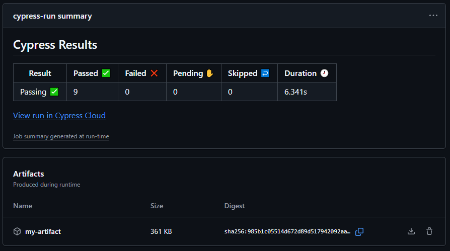

# 🧪 Testes de API com Cypress
> Testes automatizados da API [https://restful-api.dev/](https://restful-api.dev/) usando Cypress, GitHub Actions e Cypress Cloud.


[](https://cloud.cypress.io/projects/jy6b7p)


---

## 🚀 Tecnologias Utilizadas

* ⚡ **Cypress** — framework de testes E2E
* 🧩 **Node.js**
* 🧪 **Mocha** — estrutura de testes
* ☁️ **Cypress Cloud** — monitoramento e histórico das execuções
* 🤖 **GitHub Actions** — automação de CI/CD
* 📊 **cypress-mochawesome-reporter** — relatórios HTML
* 📝 **commands.js** — comandos customizados

---

## ⚙️ Estrutura do Projeto

```

📦 api-testing-cypress
┣ 📂 .github/
┃ ┗ 📂 workflows/
┃   ┗ 📜 cypress.yml           # CI/CD com GitHub Actions
┣ 📂 cypress/
┃ ┣ 📂 e2e/
┃ ┃ ┣ 📜 get.api.cy.js        # Testes GET
┃ ┃ ┣ 📜 post.api.cy.js       # Testes POST
┃ ┃ ┣ 📜 put.api.cy.js        # Testes PUT
┃ ┃ ┗ 📜 delete.api.cy.js     # Testes DELETE
┃ ┣ 📂 support/
┃ ┃ ┣ 📂 elements/
┃ ┃ ┣ 📂 pages/
┃ ┃ ┣ 📜 commands.js
┃ ┃ ┗ 📜 e2e.js
┃ ┣ 📂 reports/html/
┃ ┗ 📂 screenshots/
┣ 📜 cypress.config.js
┣ 📜 package.json
┗ 📜 .gitignore

````

---

## 🧪 Testes Implementados

### 🔹 GET (`get.api.cy.js`)

* Listar objetos: `https://api.restful-api.dev/objects`
* Buscar dispositivo por ID
* Buscar ID inexistente
* Buscar todos os dispositivos

### 🔹 POST (`post.api.cy.js`)

* Cadastrar dispositivo com sucesso
* Cadastrar sem passar body (falha da API)

### 🔹 PUT (`put.api.cy.js`)

* Cadastrar e editar dispositivo específico

### 🔹 DELETE (`delete.api.cy.js`)

* 200 - Delete sem ID
* 200 - Deletar ID existente
* 404 - Deletar ID inexistente
* 405 - Deletar ID protegido

---

## ⚙️ GitHub Actions CI/CD

Arquivo `cypress.yml`:

```yaml
name: Cypress Tests

on:
  push:
    branches: [ main ]
  pull_request:
    branches: [ main ]

jobs:
  cypress-run:
    runs-on: ubuntu-latest

    steps:
      - name: Checkout/Clone Projeto
        uses: actions/checkout@v4

      - name: Instalar dependências
        run: npm install

      - name: Rodar testes Cypress no Dashboard
        uses: cypress-io/github-action@v6
        with:
          record: true
        env:
          CYPRESS_RECORD_KEY: ${{ secrets.CYPRESS_RECORD_KEY }}

      - name: Upload de relatórios
        uses: actions/upload-artifact@v4
        with:
          name: my-artifact
          path: cypress/reports/html/
````

---

## ▶️ Como Executar Localmente

### 1️⃣ Instalar dependências

```bash
npm install
```

### 2️⃣ Rodar Cypress em modo interativo

```bash
npx cypress open
```

### 3️⃣ Rodar em modo headless com relatório

```bash
npx cypress run --reporter mochawesome
```

---

## ☁️ Cypress Cloud

Os resultados são enviados automaticamente para o **Cypress Cloud** usando a variável de ambiente:

```
CYPRESS_RECORD_KEY
```

🔗 [Acesse o painel do Cypress Cloud](https://cloud.cypress.io/projects/jy6b7p)

---

## 📸 Relatórios

Os relatórios HTML são gerados com o **Mochawesome Reporter** e enviados como artefatos



---

## ✍️ Autor

**Luis Fernando Afonso**
💼 Projeto de estudo — Automação de testes de API com Cypress + CI/CD
📧 [luis.sun@gmail.com](mailto:luis.sun@gmail.com)

---

## 🧾 Licença

Este projeto é de uso livre para fins educacionais, licenciado sob a **GNU GENERAL PUBLIC LICENSE v3.0**.
